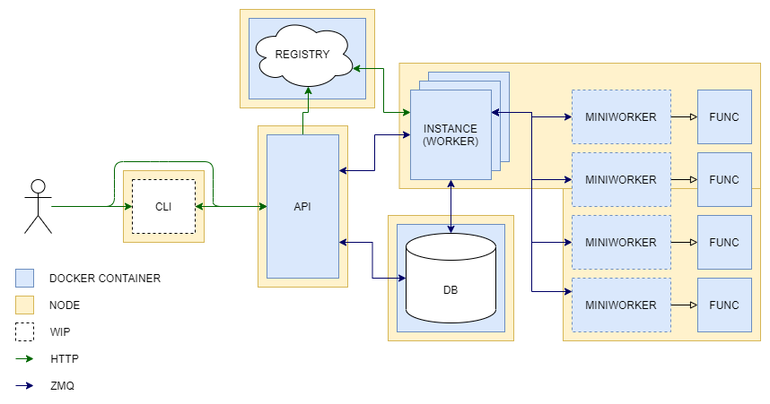
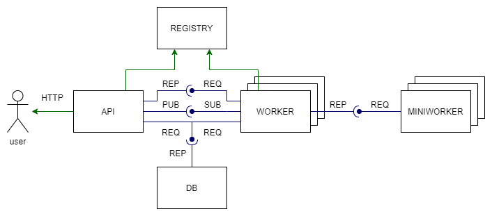

# Estado del proyecto

## Arquitectura



### API

La API está más o menos terminada, hay que ir adaptándola para las peticiones que puedan ir surgiendo, pero por lo general está completa

### REGISTRY

No necesita ningún tipo de cambio, se despliega y punto.

### DB

La DB está más o menos terminada, falta adaptar algunas llamadas y ver la política de redespliegue (si quiero que se mantengan los datos o no, etc). Falta acabar la llamada que actualiza cada una de las invocaciones, pero no preocupa mucho.

### INSTANCE (WORKER)

Aquí viene el jaleo. Se supone que esta pieza va a ser como el orquestador de cada uno de los nodos físicos que haya en la plataforma. Habla con la API para enterarse de qué runtimes/funciones/invocaciones le corresponden. Actúa sobre la política de precarga que se le haya configurado (runtime, function o nada) e invoca los contenedores. Cuando recibe el resultado de la función llama a la DB para actualizarla.

Problemas:

* **Las invocaciones de contenedores paran el hilo de node**. A día de hoy se lanzan los contenedores desde bash pero dentro de node, lo que hace que se interrumpa el hilo de ejecución. Esto puede tener algún fix, tampoco lo he mirado mucho, que solventaría el tema de los miniworkers. La idea ahora mismo es que cada uno de los miniworkers tuviera un código mínimo y gestionara su propio contenedor, de manera que el hilo ya no es bloqueante para el worker (y puede correr funciones en paralelo).

* **Los uploads**. Más adelante explicaré los requisitos de las funciones. En resumen, la función es un archivo (o varios) de código y unos requisitos para descargar las librerías necesarias. Estos archivos se comprimen en un zip y se suben a la API, que los almacena. Más adelante los necesita el worker para sus invocaciones. La manera de funcionar ahora mismo es con un volumen de docker que se bindea tanto a la API como al worker. Esto cuando estén en nodos físicos (y bajo demonios de docker) diferentes no va a ser posible. Un posible fix es mandar un multipart por ZMQ pero xdddd.

* **Políticas de invocación**. No están hechas pero no me preocupan demasiado, cuando todo lo demás funcione se hacen.

### CLI

Pues eso, un cli refachero, estaría guapo tenerlo, no le voy a mentir.

## COMUNICACIONES



### HTTP

Poco que comentar la verdad, están por ahí y se usan

### ZMQ

Aquí hay un poco más de chicha:

* **REQ-REP API-worker**: Básicamente los workers se identifican y el API los guarda. Puede valer como un canal de servicio para alguna comunicación (como para que los workers manden los outputs de las funciones directamente para que la API los sirva). Puede que se pueda eliminar en un futuro.

  Mensajes en texto plano.

* **REQ-REP DB**: La gente propone y la DB dispone. Nada, son invocaciones de funciones de la DB en remoto.

  Se manda un objeto con el nombre de la función en el campo `msgType` y la entrada (específica según función) en el campo `content`.

* **PUB-SUB**: Los workers se suscriben a canales y la api va mandando las funciones, runtimes e invocaciones al canal correspondiente. Pensándolo bien cada worker va a ser un canal, así que quizás se puede cambiar por router/router porque todos los mensajes van targeteados.

  Se manda un string partido con barras xdddddd, TBD cambiarlo por objetos por babor. 

* **REQ-REP worker-miniworker**: Clásico patrón broker-worker. Miniworker pide faena y el worker se la asigna.

  No está hecho por lo que no está especificado.

## OBJETOS

Pues pongo los objetos que se guardan para ver que tenga sentido:

### RUNTIME

|Field|Type|Description|
|-------------------|-------------------|-------------------|
|`dependencies`| String (cmd)|Command to install the deps|
|`image`|String|Docker image assigned to RT|
|`path`|String (path)|Path where the function will be stored|
|`run`|String (cmd)|Command to run the function|

* **Ejemplo**

``` json
{
    "image":"pythonruntime",
    "path":"/ws",
    "dependencies":"pip3 install -r requirements.txt",
    "run":"python3 test.py"
}
```

### FUNCTION

Muchas cosas son vestigiales del upload del multer. Apunto solo lo interesante.

|Field|Type|Description|
|-------------------|-------------------|-------------------|
|`destination`|String (path)|Folder where file is stored|
|`filename`|String|Name of the file once stored|
|`functionName`| String|Name of the function|
|`runtimeName`|String|Runtime where function will be run|

* **Ejemplo**

``` json
{
    "fieldname":"module",
    "originalname":"python.tar.gz",
    "encoding":"7bit",
    "mimetype":"application/octet-stream",
    "destination":"uploads/",
    "filename":"8c1fca3fdc33f0ef40689fcf6b89cbe2",
    "path":"uploads/8c1fca3fdc33f0ef40689fcf6b89cbe2",
    "size":315,
    "functionName":"dice",
    "runtimeName":"pythonruntime"
}
```

### CALL

|Field|Type|Description|
|-------------------|-------------------|-------------------|
|`callNum`|Integer|Call number to ID|
|`funcName`|String|Name of the function|
|`params`|Object|Input params of the call (user-made)|
|`result`|String|Call output|

* **Ejemplo**

``` json
{
    "funcName":"dice",
    "params":{"roll":"4d6"},
    "callNum":1,
    "status":"DONE",
    "result":"[4,6,4,3]"
}
```

## USAGE // API CALLS

Esto lo replazará el CLI.

### POST registerRuntime

Register a runtime.

* **Input**: Runtime object. Para que la imagen se detecte tiene que estar disponible en el cliente de docker desde el nodo que se llame (puede ser un remoto de dockerhub tmb). Básicamente debe tener el entorno (sin los requirements específicos) para ejecutar la función.

* **Output**: HTTP Code.

* **Example**:

  ``` bash
    curl --header "Content-Type: application/json" \
        -X POST \
        --data '{"image": "pythonruntime","path": "/ws","dependencies": "pip3 install -r requirements.txt","run":"python3 test.py"}' \
        localhost:3000/registerRuntime
  ```

### POST registerFunction/:runtime/:funcName

Register a function.

* **Input**: Zip de la función. Requerimientos y código. Debe seguir las pautas marcadas por su runtime. El ejemplo son un archivo `test.py` y un archivo `requirements.txt` en el root del zip.

* **Output**: HTTP Code.

* **Example**:

  ``` bash
    curl -X POST \
        -F module=@../runtimes/python/dice/python.tar.gz \
        localhost:3000/registerFunction/pythonruntime/dice
  ```

### POST invokeFunciton

Register a function.

* **Input**: funcName y params.

* **Output**: HTTP Code.

* **Example**:

  ``` bash
    curl --header "Content-Type: application/json" \
        -X POST --data '{"funcName":"dice", "params": {"roll":"4d6"}}' \
        localhost:3000/invokeFunction
  ```

### GET runtimes

Get the runtime list.

* **Input**: Nada.

* **Output**: Array de runtimes.

* **Example**:

  ``` bash
    curl localhost:3000/runtimes

    ["pythonruntime"]
  ```

### GET functions

Get the function list.

* **Input**: Nada.

* **Output**: Array de functions.

* **Example**:

  ``` bash
    curl localhost:3000/functions

    ["dice"]
  ```

### GET calls

Get the call list.

* **Input**: Nada.

* **Output**: La callstore.

* **Example**:

  ``` bash
    curl localhost:3000/calls

    {"c1":{"funcName":"dice","params":{"roll":"4d6"},"callNum":1,"status":"PENDING","result":""}}
  ```

### GET call/:Callnum

Get a specific call.

* **Input**: Nada.

* **Output**: Call.

* **Example**:

  ``` bash
    curl localhost:3000/call/1

    {"funcName":"dice","params":{"roll":"4d6"},"callNum":1,"status":"PENDING","result":""}
  ```